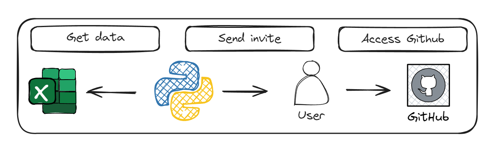

# Acesso automatizado ao Github

O programa tem o objetivo de enviar convites automatizados para um repositório específico específico do Github, com base em uma planilha de Excel que vai obter o user e o tipo de acesso adequado ao user.

## Arquitetura


## Pré-requisitos
* Python 3.10
* Libs do Python

```
openpyxl           3.1.5
pandas             2.2.2
python-dotenv      1.0.1
requests           2.32.3
```

## Como utilizar a automação?
Clone o repositório
```
git clone https://github.com/wlcamargo/access_github_automated
```

Entre na pasta
```
cd access_github_automated
```

Crie o ambiente virtual
```
python3 -m venv venv
```

Entre no ambiente virutal (Linux)
```
source venv/bin/activate
```

Instale as dependências
```
pip install -r requirements.txt
```

Atualize a planilha ```collaborators.xlsx``` com os users que deseja dar acesso ao repositório.

Atualize o arquivo com os valores das variáveis corretas no arquivo ```.env_sample``` e altere o nome dele para ```.env```

Execute o programa ```main.py```

## Referências

https://docs.github.com/en/rest?apiVersion=2022-11-28


## Developer
| Desenvolvedor      | LinkedIn                                   | Email                        | Portfólio                              |
|--------------------|--------------------------------------------|------------------------------|----------------------------------------|
| Wallace Camargo    | [LinkedIn](https://www.linkedin.com/in/wallace-camargo-35b615171/) | wallacecpdg@gmail.com        | [Portfólio](https://wlcamargo.github.io/)   |


